
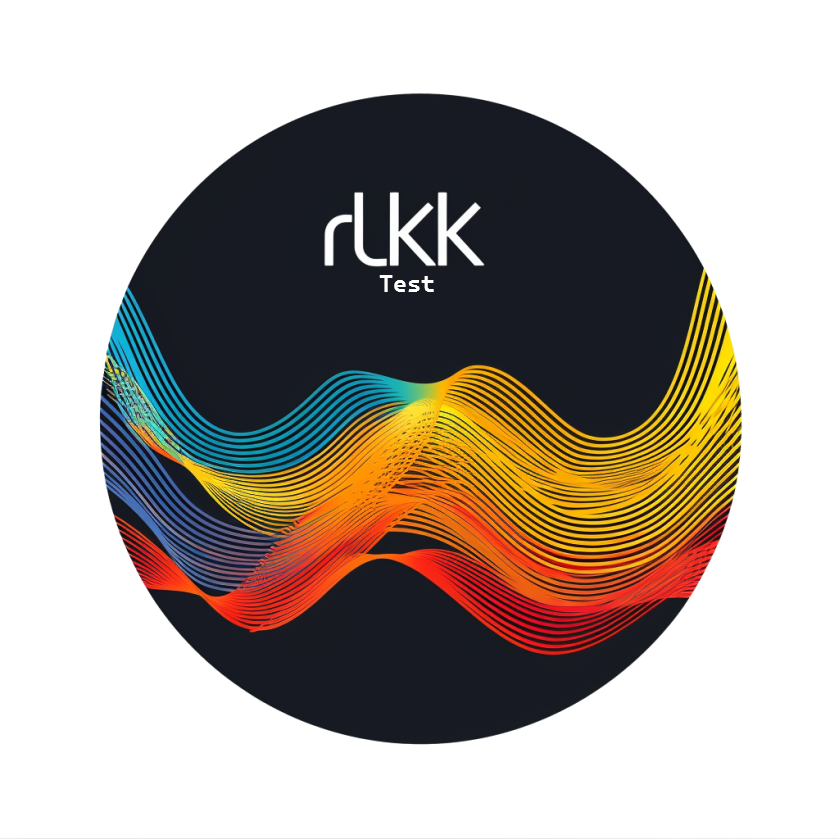

# Regularized Linear Kramers-Kronig

Version 1.0.0

## Introduction to rLKK
Regularized Linear Kramers Kronig (rLKK) is a data consistency checking tool that is used to analyze and validate spectroscopic data. It is based on the Kramers-Kronig relations, which are fundamental principles in physics that relate the real and imaginary parts of a complex-valued function. 

Here are some key points about the rLKK method:

1.  **Data Consistency Check**: The primary purpose of rLKK is to verify the consistency of experimental spectroscopic data. It checks whether the measured real and imaginary parts of the complex dielectric function (or any other complex-valued response function) satisfy the Kramers-Kronig relations.
2.  **Regularization**: The "regularized" aspect of rLKK refers to the use of regularization techniques to handle noisy or incomplete data. Experimental data often contains noise or has gaps due to limitations in the measurement range. Regularization helps to smooth these distorted data, allowing for more reliable Kramers-Kronig analysis.
3.  **Data Correction**: If the measured data violates the Kramers-Kronig relations, rLKK can be used to correct the data by adjusting either the real or imaginary part (or both) to ensure self-consistency. This correction process is based on minimizing the deviation from the Kramers-Kronig relations while preserving the essential features of the data. *It should be noted that correction only works if the distortion' is white (average at 0)*
4. **Authorship**: This method is an extension of Boukamp's Linear Kramers Kronig. Regularization is already established in many fields, and I have just brought it to Impedance Spectroscopy as an optimization to Boukamp's LKK.
- Boukamp, Bernard A. "A linear Kronig‐Kramers transform test for immittance data validation." _Journal of the electrochemical society_ 142.6 (1995): 1885.
- Kallel, Ahmed Yahia, and Olfa Kanoun. "Regularized linear kramers-kronig transform for consistency check of noisy impedance spectra with logarithmic frequency distribution." _2021 International Workshop on Impedance Spectroscopy (IWIS)_. IEEE, 2021.
- Kanoun, Olfa, and Ahmed Yahia Kallel. "High-performance efficient embedded systems for impedance spectroscopy: Challenges and potentials." _Electrochimica Acta_ (2024): 144351.
5.  **Applications**: The rLKK method finds applications in various fields, including impedance spectroscopy, bioimpedance spectroscopy, with a focus on electrochemical systems, such as batteries.

## On the software
rLKK Test is a graphical interface to [rLKK package](https://github.com/kallelay/rlkk), previously published for Python and MATLAB users. This software is a standalone and is made using VB.NET (I program for VB6/VB.NET since 2008 and it's most comfortable software for me). No programming knowledge is needed to get it started.

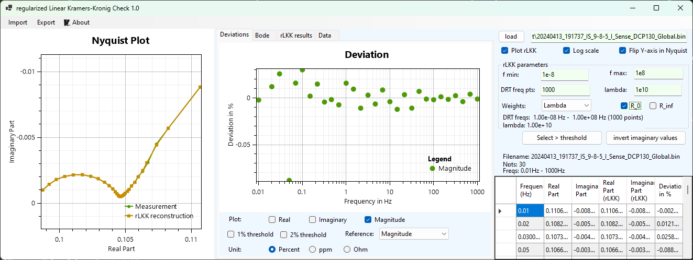

To work with rLKK test, few steps are necessary
1. Load the data file (CSV, TSV, MAT [containing f and Z], TXT). 
The script is made to automatically detect the delimiter and data. It supports Agilent A4294 file type and compatible files and almost every file with "frequency", "real", and "imaginary" 
2. Select the appropriate rLKK parameters
For this, you need to adjust "lambda" and "fmin" and "fmax". These are called 'Distribution of Relaxation Times' parameters
* ALWAYS sure that "fmin" (DRT frequency) is smaller than the minimum measurement frequency, and that "fmax" (DRT frequency) is larger than the maximum measurement frequency. 
* Lambda should be either "small" (in lenient mode: 1e-9 to 1e-1) or too "large" (in aggressive mode: 1e-3 to 1e15). larger = higher bias in the model and less trust from measurement data, recommending a large lambda in the case of noisy or highlight distorted measurement. 
* The number of frequencies in DRT should be adequately chosen so at least there is 6 freq per each decade in DRT frequencies 
* R_0 and R_inf: adds R_0 or R_inf to DRT equations. Typically R_0 is recommended.
3. Check rLKK results tab to make that there is no huge oscillations in the results (1e20). It should be noted that "lenient" uses high rLKK "x" values while "aggressive" uses small rLKK values.

#### **Using rLKK for consistency check**
rLKK can provides which points are consistent and can help eliminate bad measurements.
In this case, please eliminate all values above 2%, or 1% deviations. Note that those are "rules" of thumbs and is discern for the user to select the adequate threshold values

For this, you can manually select the point (from Nyquist plot, deviation plot, or selecting the full row of the point), as shown in the next figure:
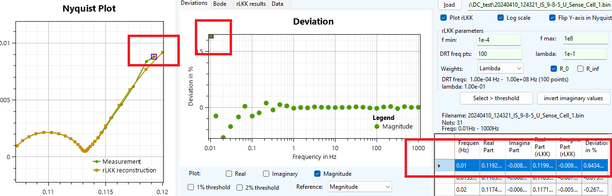

By pressing "delete" on your keyboard, the selected points will be removed. ___This will not affect the loaded file___. Make sure to save the data once you have deleted the points with measurement problems. This can be done using Export --> Data
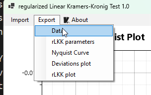

The exported file will contain 6 columns. Please use the first, second, and third columns:
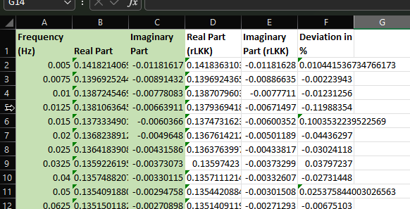

#### **Using rLKK for correction**
rLKK can be used to correct the measurement data, when the measurements' deviation is centered around "0". In this case, following a correct and adequate rLKK parameter setting, click on Export -> Data

The exported file will contain 6 columns. Please use the first, fourth, and fifth columns:
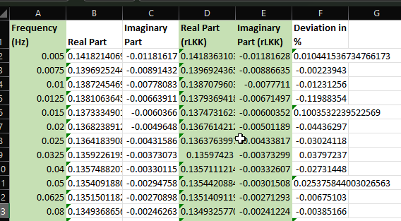

### Configuring rLKK: Lenient rLKK
For a linient rLKK, make sure that "fmin" (DRT frequency) is smaller than the minimum measurement frequency, and that "fmax" is larger than the maximum frequency. Allow one to two decades (For example if measurements are between 1 Hz (1e0) and 100 Hz (1e2), DRT can be 1e-1 to 1e3)
The number of points should not exceed 20 freq/dec (remember: 1 Hz to 100 Hz are two decades because 1e0 -> 1e1 is one decade and 1e1 -> 1e2 is the second decade, 20 freq/dec means maximum number of points is 20*2=40)
R_0 should be put to enabled.
Lambda should be 1e-7 to 1e-1 (0.1). Visually, rLKK reconstruction in Nyquist (and Bode) should not follow distortions, a higher lambda can be used to enable this. 
(remember, a higher lambda means 1e-3 should become 2e-3, ..., 9e-3, 10e-3 = 1e-2, ..., 1e-1)
Make sure that both R_0 and R_inf are checked.

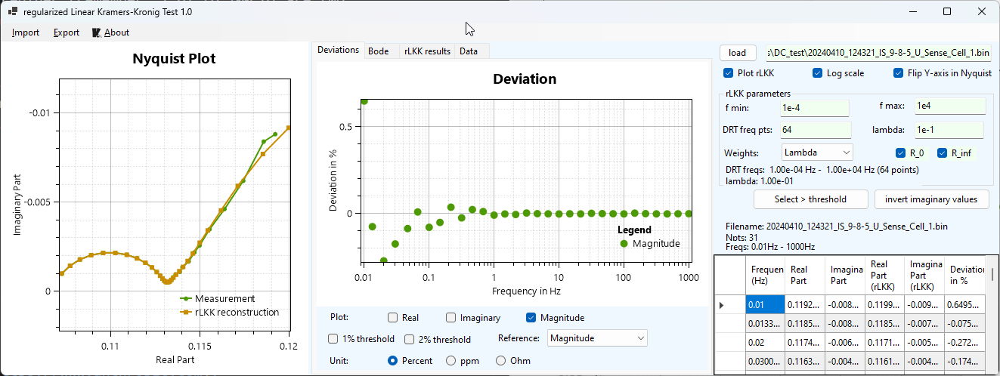
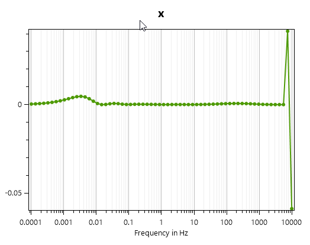

You can zoom in Nyquist plot (Use a mouse with a wheel, use the wheel) to ensure that that lambda can visually provide a good consistency:
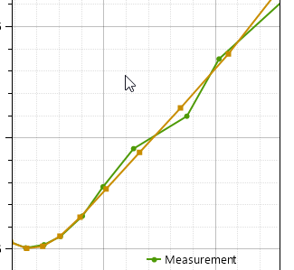

**The lenient mode is recommended for measurement with small deviations that do not hinder the overall behavior of the system**

### Configuring rLKK: Aggressive rLKK
Aggressive rLKK follows the original rLKK algorithm. By using a large fmin and fmax, possibility 1e-8 to 1e8 or 1e-20 to 1e20 (or 1e-8 to 1e20),  a large DRT frequency points, such as 1000, and a large lambda (10 to 1e8), the ideal behavior of the measurement from extremely distorted data can be extracted. R_0 and R_inf do not need to be enabled.

   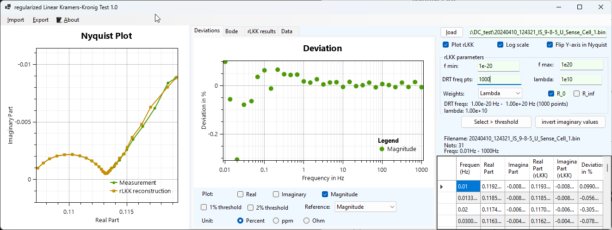 

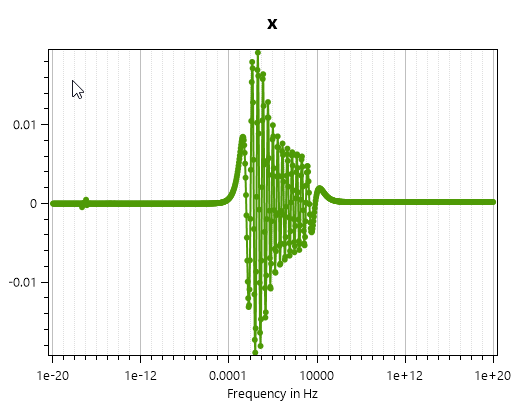

**Agressive rLKK is recommended in the case of high noise or deviations, in this case, the number of DRT frequency pts should be adequately chosen to allow a just/good approximation**

## Working with plots:
Plots allows a fast visualization of the data. Nyquist plot, Bode plot, and deviations plots are connected. If you select a point in Nyquist or Bode plots, it'll also be selected in the other plot, as well as the row. 

In the plot, you can use 
* left click to select one point, or obtain the information about one point
* right click (press, hold, and move) to pan the plot
* middle mouse click (click on the screen mouse): to select a region and zoom it
* Double click on the middle (wheel) button resets the view
* Mouse with 4 and 5 buttons: the 4 and 5th buttons allow for gradual zoom in and out
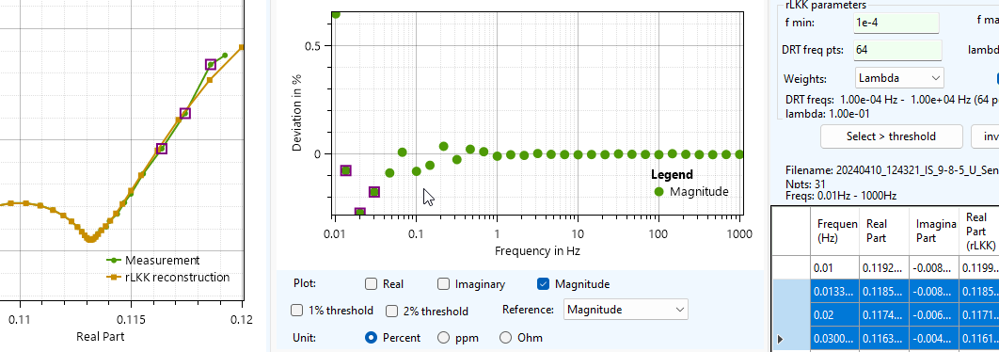

It is possible to export the plots as png, pdf, or svg (svg is recommended).
 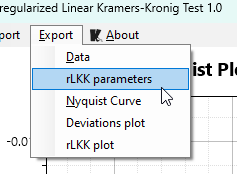

## Working with table and editing values
Within the program, it is possible to update by removing or editing values of the impedance spectrum
This can either be done using "Data" tab
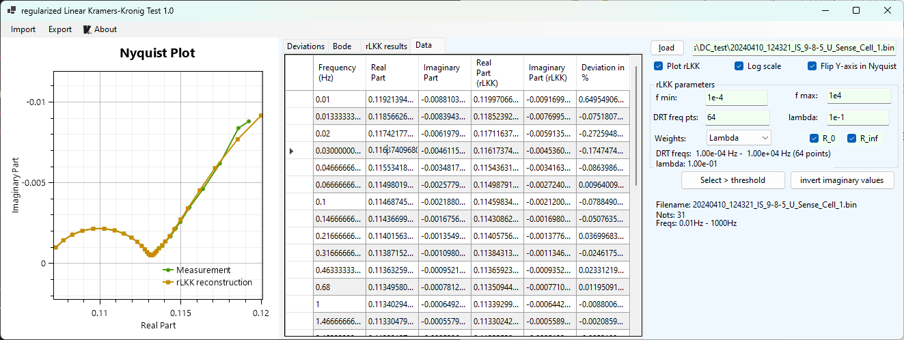
Or directly in the data, when "Data" tab is not selected
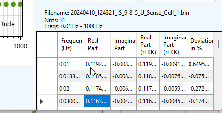

When deviations are higher (absolute value) than 1%, they will be highlighted in the data table. Yellow are deviations > 1% and < 2%. Deviations greater than 3% are highlighted in dark red.
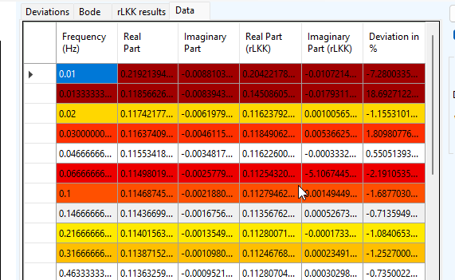

Made with ❤️ in 
Edited from [Claude](https://www.anthropic.com)
> Written with [StackEdit](https://stackedit.io/) and VSCode.
